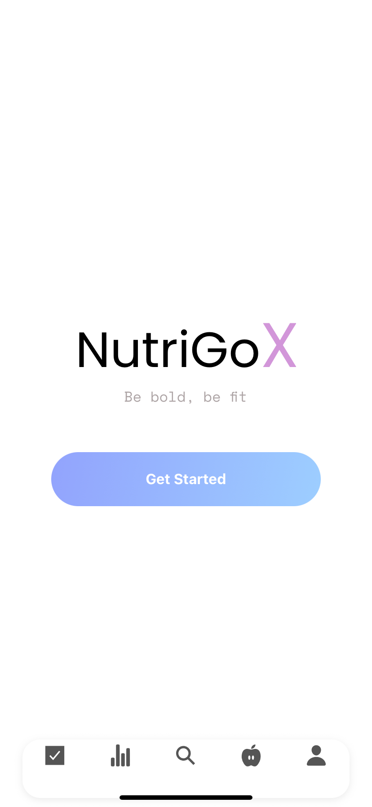
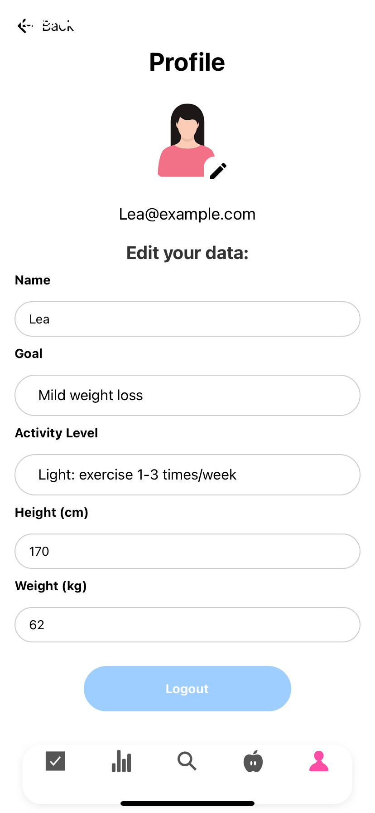
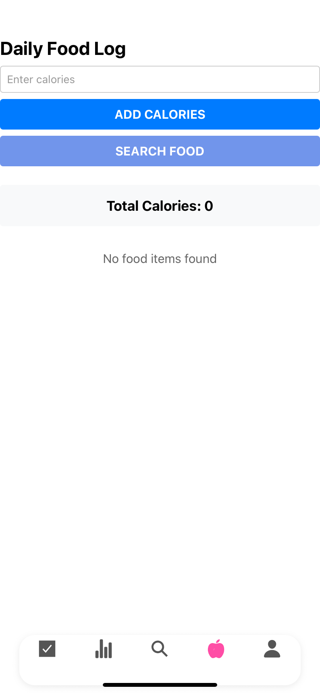
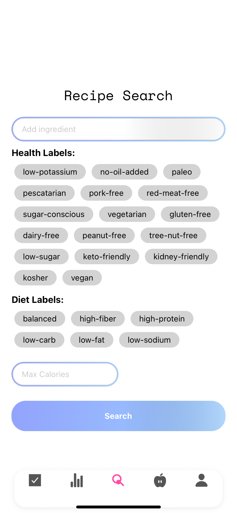
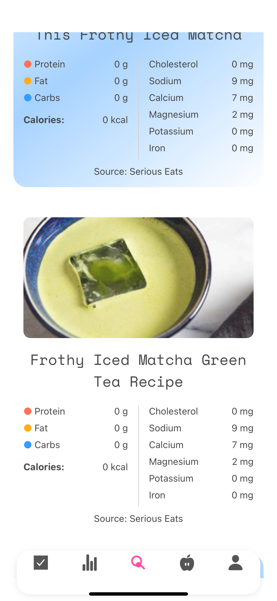
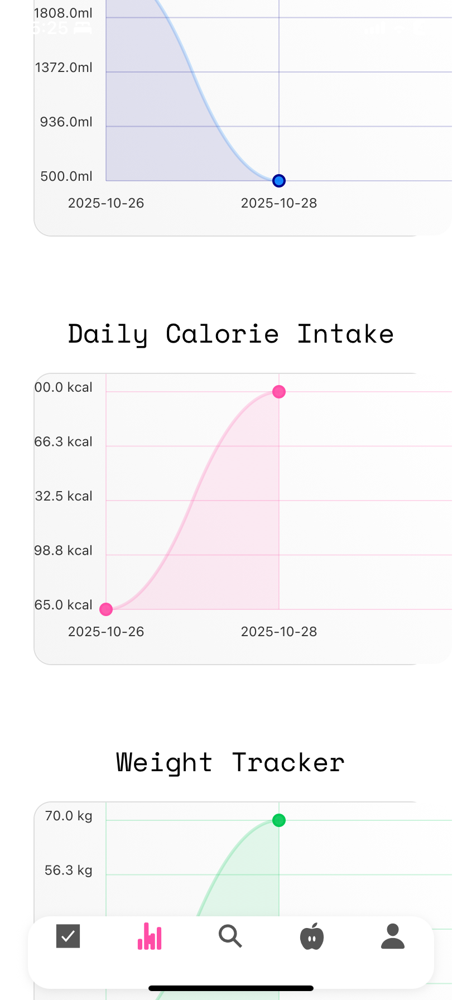
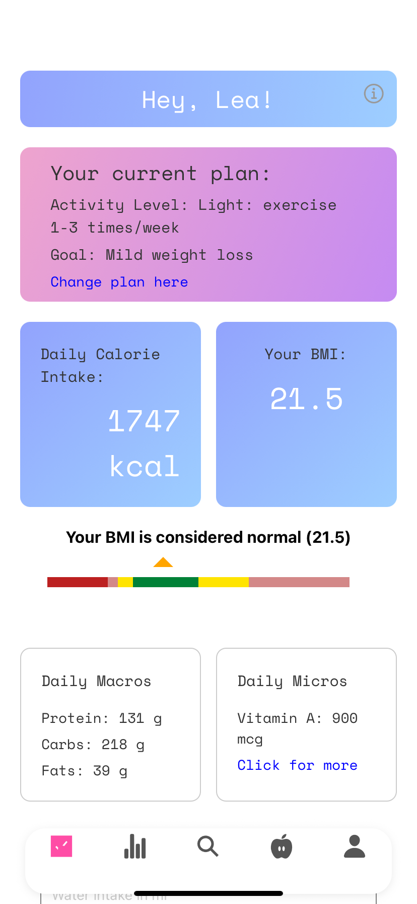
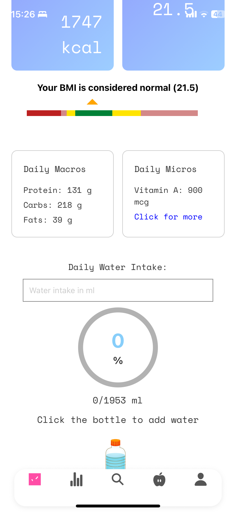
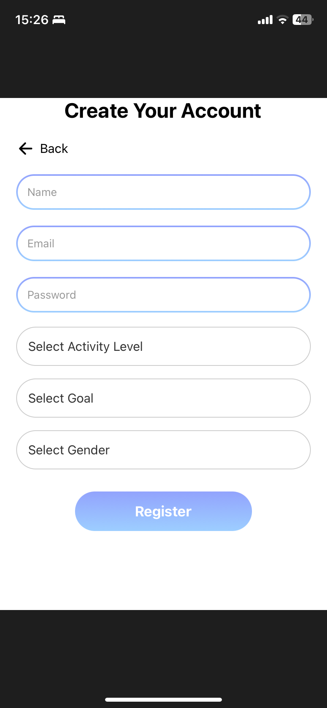
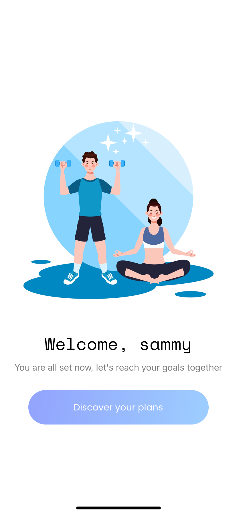

# NutriGo - Praktikum II

Funkcionalnosti mobilne aplikacije:
- Registracija uporabnika z podrobnostmi kot so starost, višina, teža, aktivnost
- Spremljanje vnosa hrane - podroben vnos hranilnih snovi izdelkov
- Uporabniki lahko uporabijo kamero za skeniranje BAR kod izdelkov. Če izdelek obstaja v bazi mu ga predlaga, če ne ga vnese ročno
- Priporočanje receptov glede na cilj uporabnika (izguba teže, pridobivanje mase), cilj izbere ob registraciji ali ga kasneje spremeni
- Vnašanje in sledenje dnevne teže uporabnika
- Dnevna analiza vnosov - graficni prikaz statistike vnosa vode, hrane, teze

  Tehnologije mobilne aplikacije:
  - React Native
  - Typescript
  - Firebase
  - Expo Router
  - Edamam API
  - Stepzen GraphQL
  - Apollo Client


# NutriGo - Praktikum II

## 📖 Celotna dokumentacija
Za podrobnejši in formalni opis projekta si prenesite originalni DOCX dokument: [dokumentacija.docx](dokumentacija/dokumentacija.docx)

---

## 1. Namen aplikacije

NutriGo je mobilna aplikacija za spremljanje prehrane, telesne teže, hidracije ter osebnega napredka. Uporabniku omogoča ustvarjanje računa, urejanje profila, beleženje kalorij, iskanje receptov in pregled statistike v preglednih grafih. Aplikacija je namenjena podpori pri doseganju osebnih prehranskih ciljev.

---

## 2. Glavne funkcionalnosti

### Uvodni zaslon
Prikaz logotipa in gumb za začetek.



### Registracija in prijava
Uporabnik lahko ustvari račun ter določi osnovne podatke, kot so ime, email, cilj, spol, nivo aktivnosti in geslo.




### Profil uporabnika
Možnost urejanja vseh osebnih podatkov, spremljanje višine, teže, ciljev in nivoja aktivnosti.



### Dnevni vnos kalorij in hrane
Vnos kalorij, pregled skupnega dnevnega vnosa ter iskanje hrane po API-ju.



### Iskanje receptov
Uporabnik lahko išče recepte glede na sestavine, kalorije in različne prehranske oznake (npr. vegetarijansko, brez glutena).




### Statistika in sledenje
Aplikacija prikazuje napredek v obliki grafov: dnevni vnos kalorij , hidracija  in spremljanje teže.



### Glavna nadzorna plošča
Povzetek uporabnikovih podatkov: dnevni kalorijski plan, BMI, makrohranila, mikrohranila in voda.




---

## 3. Tehnološki opis

Aplikacija je razvita kot mobilna rešitev z uporabo modernih spletnih in mobilnih tehnologij. Temelji na arhitekturi **React Native** in deluje znotraj **Expo** okolja, kar omogoča hitro testiranje na fizični napravi. Za shranjevanje podatkov aplikacija uporablja lokalni pomnilnik naprave, za pridobivanje receptov pa uporablja zunanji API.

### 🛠 Tehnologije mobilne aplikacije

- React Native
- Typescript
- Firebase
- Expo Router
- Edamam API
- Stepzen GraphQL
- Apollo Client

---

## 4. Struktura podatkovne baze (Firebase NoSQL)

Rešitev uporablja NoSQL podatkovno bazo **Firebase** za shranjevanje podatkov.

### Primer strukture uporabnika (User)

Trenutno se uporablja samo struktura uporabnika:

```json
{
  "activityLevel": "Light: exercise 1-3 times/week",
  "age": 22,
  "calorieIntake": 0,
  "email": "Lea@example.com",
  "gender": "female",
  "goal": "Mild weight loss",
  "height": 170,
  "id": "p3Sz8Tu82NPrvoeroQMNT4qQqS73",
  "name": "Lea",
  "password": "lea123",
  "weight": 62
}
```
---

## 5. Zaključek

NutriGo je celovita mobilna aplikacija za podporo uporabnikom pri uravnavanju prehrane in spremljanju zdravja. Aplikacija združuje pregledno uporabniško izkušnjo, personalizirane izračune in podatkovno podprto iskanje receptov. Primerna je za vsakogar, ki želi spremljati svoj napredek ali preprosto izboljšati svoje prehranske navade.

---

## 🚀 NutriGo - Inicializacija

### Potrebni ukazi

Za zagon projekta sledite tem korakom (potrebno je namestiti npm in Node.js):

```bash
cd NutriGo
rm package-lock.json
npm cache clean --force
npm install --legacy-peer-deps
npx expo start -c
